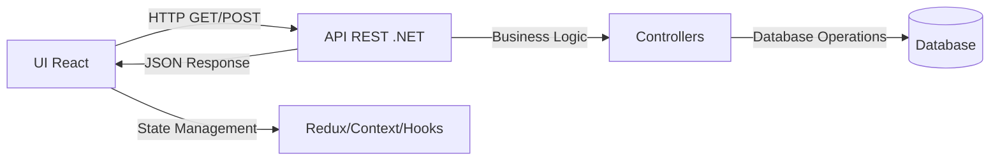

## Perfil

Consulte o meu perfil <a href="https://github.com/alexandervieira/alexandervieira/blob/master/README.md">aqui</a>.

<h1 align="center" style="font-weight: bold;">Activity App 💻 - Plataforma de Gestão de Atividades</h1>

Uma aplicação full-stack para gerenciamento de atividades, desenvolvida com arquitetura moderna separando frontend e backend.

## Índice

- [Perfil](#perfil)
- [Índice](#índice)
- [Sobre o Projeto](#sobre-o-projeto)
  - [Principais Características](#principais-características)
- [Stack Tecnológico](#stack-tecnológico)
  - [FrontEnd](#frontend)
  - [BackEnd](#backend)
- [Estrutura da Arquitetura](#estrutura-da-arquitetura)
  - [Fluxo de Comunicação](#fluxo-de-comunicação)
- [Começo Rápido](#começo-rápido)
  - [Pré-requisitos](#pré-requisitos)
  - [Instalação e Execução](#instalação-e-execução)
    - [1. FrontEnd (React App)](#1-frontend-react-app)
    - [2. BackEnd (API .NET)](#2-backend-api-net)
    - [3. Testar a Integração](#3-testar-a-integração)
- [Estrutura do Repositório](#estrutura-do-repositório)
  - [Pasta FrontEnd](#pasta-frontend)
  - [Pasta BackEnd](#pasta-backend)
- [Fluxo de Dados](#fluxo-de-dados)
- [Comandos Úteis](#comandos-úteis)
  - [Frontend](#frontend-1)
  - [Backend](#backend-1)
  - [Git](#git)
- [Padrões de Desenvolvimento](#padrões-de-desenvolvimento)
- [Erros e Solicitações de Recursos](#erros-e-solicitações-de-recursos)
- [Contribuição](#contribuição)
- [Criador](#criador)
- [Agradecimentos](#agradecimentos)
- [Direitos e licença](#direitos-e-licença)

## Sobre o Projeto

O **Activity App** é uma solução completa para gestão de atividades, permitindo que usuários criem, visualizem, editem e gerenciem suas atividades de forma intuitiva. O projeto segue uma arquitetura moderna com separação clara entre camadas de frontend e backend.

### Principais Características

- ✅ Interface responsiva e moderna com React + TypeScript
- ✅ API REST robusta com .NET 10
- ✅ Sistema de roteamento avançado
- ✅ Componentes UI reutilizáveis
- ✅ Integração entre FrontEnd e BackEnd
- ✅ Suporte a múltiplas páginas e recursos

## Stack Tecnológico

### FrontEnd
- **React 19.2** - Biblioteca UI moderna
- **TypeScript 5.9** - Tipagem estática
- **Vite 7.2** - Build tool rápido e moderno
- **React Router 7.10** - Roteamento de páginas
- **TailwindCSS 4.1** - Estilização com utilitários
- **Axios 1.13** - Cliente HTTP
- **Bootstrap 5.3** - Componentes e estilos
- **FontAwesome 7.1** - Ícones vetoriais

### BackEnd
- **.NET 10** - Framework web de alta performance
- **ASP.NET Core** - Framework para API REST
- **OpenAPI/Swagger** - Documentação automática de API

## Estrutura da Arquitetura

```
Activity/
│
├── FrontEnd/
│   └── activity-app/                    # Aplicação React
│       ├── src/
│       │   ├── components/              # Componentes reutilizáveis
│       │   │   ├── layout/              # Componentes de layout (Header, Footer, Sidebar)
│       │   │   └── ui/                  # Componentes UI puros (Button, Card, Input, etc)
│       │   ├── pages/                   # Páginas da aplicação
│       │   │   ├── Home/                # Página inicial
│       │   │   ├── Activities/          # Listagem e gerenciamento de atividades
│       │   │   ├── Customers/           # Gerenciamento de clientes
│       │   │   └── About/               # Página sobre
│       │   ├── services/                # Serviços e integração com API
│       │   │   └── api.ts               # Cliente HTTP/Axios configurado
│       │   ├── hooks/                   # React Hooks customizados
│       │   ├── model/                   # Modelos de dados TypeScript
│       │   ├── routes/                  # Configuração de rotas
│       │   ├── styles/                  # Estilos globais CSS
│       │   ├── assets/                  # Imagens e recursos estáticos
│       │   ├── App.tsx                  # Componente raiz
│       │   └── main.tsx                 # Ponto de entrada
│       ├── package.json                 # Dependências e scripts
│       ├── vite.config.ts               # Configuração do Vite
│       ├── tsconfig.json                # Configuração TypeScript
│       ├── tailwind.config.js           # Configuração TailwindCSS
│       └── postcss.config.cjs           # Configuração PostCSS
│
└── BackEnd/
        ├── src/
        │   └── AVS.Activity.Api/        # Projeto principal da API
        │       ├── Controllers/         # Controllers REST
        │       │   └── WeatherForecastController.cs
        │       ├── Properties/
        │       │   └── launchSettings.json
        │       ├── appsettings.json     # Configurações gerais
        │       ├── appsettings.Development.json  # Config desenvolvimento
        │       ├── Program.cs           # Configuração da aplicação
        │       └── AVS.Activity.Api.csproj  # Arquivo do projeto
        ├── AVS.Activity.sln             # Solução Visual Studio
        └── global.json                  # Configuração global .NET
```

### Fluxo de Comunicação

```
┌─────────────────────────────────────────────────────────┐
│                    FRONTEND (React)                     │
│  ┌────────────────────────────────────────────────────┐ │
│  │  Pages (Activities, Customers, Home, About)        │ │
│  │           ↓                                         │ │
│  │  Components (Layout, UI, Forms)                    │ │
│  │           ↓                                         │ │
│  │  Services (API Client - Axios)                     │ │
│  └────────────────────────────────────────────────────┘ │
└──────────────────┬──────────────────────────────────────┘
                   │ HTTP/REST
                   ↓
┌──────────────────────────────────────────────────────────┐
│              BACKEND (ASP.NET Core .NET 10)             │
│  ┌────────────────────────────────────────────────────┐ │
│  │  Program.cs (Configuração e Middleware)           │ │
│  │           ↓                                        │ │
│  │  Controllers (Rotas e lógica de requisição)       │ │
│  │           ↓                                        │ │
│  │  Lógica de Negócio e Dados                       │ │
│  └────────────────────────────────────────────────────┘ │
└─────────────────────────────────────────────────────────┘
```

## Começo Rápido

### Pré-requisitos

- **Node.js** 18+ (para FrontEnd)
- **.NET SDK 10.0+** (para BackEnd)
- **Git** para controle de versão

### Instalação e Execução

#### 1. FrontEnd (React App)

```bash
# Navegar até o diretório do frontend
cd FrontEnd/activity-app

# Instalar dependências
npm install

# Iniciar servidor de desenvolvimento
npm run dev

# Build para produção
npm run build

# Validar código com ESLint
npm run lint

# Preview da build de produção
npm run preview
```

A aplicação estará disponível em `http://localhost:5173`

#### 2. BackEnd (API .NET)

```bash
# Navegar até o diretório do backend
cd BackEnd

# Restaurar dependências
dotnet restore

# Executar a API em desenvolvimento
dotnet run --project src/AVS.Activity.Api/AVS.Activity.Api.csproj

# Ou compilar e depois executar
dotnet build
cd src/AVS.Activity.Api
dotnet run
```

A API estará disponível em `https://localhost:7002` (HTTPS)

#### 3. Testar a Integração

Após iniciar ambos os serviços, a aplicação React consumirá a API do ASP.NET Core. A base URL da API é configurada em [src/services/api.ts](FrontEnd/activity-app/src/services/api.ts).

## Estrutura do Repositório

Veja como navegar entre pastas aqui:

### Pasta FrontEnd

A pasta `FrontEnd/activity-app` contém toda a aplicação React:

```
activity-app/
├── src/
│   ├── components/          # Componentes React reutilizáveis
│   ├── pages/               # Páginas/Telas da aplicação
│   ├── services/            # Serviços (integração com API)
│   ├── hooks/               # React Hooks customizados
│   ├── model/               # Definições de tipos TypeScript
│   ├── routes/              # Configuração de rotas
│   ├── styles/              # CSS e estilos globais
│   ├── App.tsx              # Componente principal
│   └── main.tsx             # Ponto de entrada
├── public/                  # Arquivos estáticos
├── package.json             # Dependências do npm
├── tsconfig.json            # Configuração TypeScript
├── vite.config.ts           # Configuração do Vite
├── tailwind.config.js       # Configuração TailwindCSS
└── README.md                # Documentação específica do frontend
```

### Pasta BackEnd

A pasta `BackEnd` contém a API ASP.NET Core:

```
BackEnd/
├── src/
│   └── AVS.Activity.Api/    # Projeto principal da API
│       ├── Controllers/     # Controllers REST (rotas da API)
│       ├── Properties/      # Configurações de projeto
│       ├── appsettings.json # Configurações gerais
│       ├── Program.cs       # Configuração e startup da aplicação
│       └── AVS.Activity.Api.csproj
├── AVS.Activity.sln         # Solução Visual Studio
└── global.json              # Configuração global do .NET SDK
```

## Fluxo de Dados



## Comandos Úteis

### Frontend
```bash
npm run dev      # Iniciar servidor de desenvolvimento
npm run build    # Compilar para produção
npm run lint     # Verificar código com ESLint
npm run preview  # Visualizar build de produção
```

### Backend
```bash
dotnet run              # Executar a API
dotnet build            # Compilar o projeto
dotnet restore          # Restaurar dependências
dotnet watch run        # Executar com hot reload
```

### Git
Consulte a lista de comandos úteis do GIT <a href="https://github.com/alexandervieira/lista-comandos-git/blob/master/README.md">aqui</a>.

## Padrões de Desenvolvimento

- **Componentes**: Sempre criar componentes funcionais com hooks
- **Tipos**: Usar TypeScript para todas as novas features
- **Estilos**: Preferir TailwindCSS para novos estilos
- **API**: RESTful com controllers bem estruturados
- **Commits**: Seguir padrão de commit semântico

## Erros e Solicitações de Recursos
Tem um bug ou uma solicitação de recurso? Leia primeiro as [diretrizes do problema](https://reponame/blob/master/CONTRIBUTING.md)  e pesquise os problemas existentes e encerrados. [abra um novo problema](https://github.com/alexandervieira/Repositorio.Default/issues).

## Contribuição

Por favor, leia nossas [diretrizes de contribuição](https://reponame/blob/master/CONTRIBUTING.md). Estão incluídas instruções para abrir questões, padrões de codificação e notas sobre o desenvolvimento.

## Criador

- <https://github.com/alexandervsilva>

## Agradecimentos

Obrigado por consultar, divulgar ou contribuir.

## Direitos e licença

Código e documentação com copyright 2021 dos autores. Código divulgado sob a [MIT License](https://github.com/alexandervieira/Repositorio.Default/blob/master/LICENSE).

<h3>Documentações que podem ajudar</h3>

[📝 Como criar um Pull Request](https://www.atlassian.com/br/git/tutorials/making-a-pull-request)

[💾 Commit pattern](https://gist.github.com/joshbuchea/6f47e86d2510bce28f8e7f42ae84c716)
